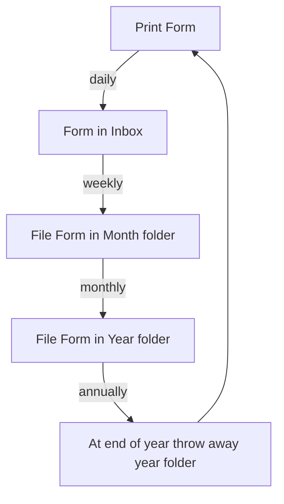

Title: People, Process, and Priorities
Date: 2025-02-26
Author: ryan
Tags: process, priorities
Slug: people-process-and-priorities
Series: Remove if Not Needed
Status: draft

I'm not sure where I first heard the idea of People, Processes, and Priorities, but it really stuck with me. My recollection is that these are things that are vital in any organization to help solve problems.

First, let's define what each of these mean from an organizational perspective:

1. People - The people that will help to solve the problems
2. Processes - The process that people will follow in order to help solve problems
3. Priorities - The order in which we will solve the problems together

Each one of these are interdependent, but they can also be ranked. And once you rank them you can largely tell what kind of organization you'll be in.

Ranking priorities first generally, in my experience leads to lots of changes to priorities. This week it's shipping a new feature to make all of the buttons cornflower blue ... next week it's adding AI slop to the applicaiton. The week after that it's to mine bitcoin. Priorities shift, and that's OK, but priority driven organizations seem to not have a true defining north star to help guide those priorities. That leads to chaos

Ranking People first sounds like a good idea. I mean, who doesn't want to put people first? I have found however that when people are prioritized first other bad things can happen. Cliques can form. Only Sally can do thing X and their out for the next three weeks and no, there isn't any documentaiton on how to do that. Management can be lax because that's just Bob being Bob and can lead to toxic work environments.

I think that putting process first helps to mitigate, though not outright eliminate, these concerns.

Proceses help to determine how we do thing X. If Sally is out, that's Ok because we have a process and documentation to help us through it. Will we get it done as quickly as Sally did? No, but we will get it done before they come back.

Processes also help implement things like Codes of Conduct. Again, that won't prevent cliques from forming, and no it won't keep Bob from being a jerk, but it creates a framework to help deal with Bob being a jerk and potentially removing them from the situation entierly.

Processes can also help with prioritization. Having a process that helps to guide HOW you prioritize can be very helpful. This doesn't prevent you from switching up your priorities, but it does help to keep you focused on something long enough. And when you need to change a priority it's a lot easier (and healthier) to be able to point to the process that drove the deicsion to change versus, I don't know, the CEO saw something on Bloomberg and now we're doing this.

But setting up processes is hard. And in a small enough environment it can seem like it's not even worth it. Why have a 17 page document that talks about how priorities are chosen if it's just a handful of people? And yes, that IS hard. And it might not seem like it's worth it. But you don't need a big long document to determine a process on how to change priorities. It can be as simple as

> We are small and acknowledge that change is required. We will only change when a concensus of 60% of the team agree with the change OR if the CEO and CFO agree on the change.

More complication processes can come later. But at least now when a change is needed you know HOW you're going to talk about that change!

OK, if Priorities are first, what comes second? I find that People should be next. It's the people that are going to help make everything happen. It's the people that are going to help get you over the finish line. It's people that will work the processes.

Once you have Good processes and good people then you can really start to set priorities that EVERYONE will, if not buy into, at least understand why they are what they are.

My least favorite answer to the question, "Why do we do it this way?" is "I don't know."

There's just so much broken culture in that statement. It could be that when you started you did ask questions, but you were shot down so many time for asking that you just stopped asking. It could be that you're not very curious and someone just told you and didn't provide a reason and you just accepted it as gospel that this is the way that it needs to be done.

The reason why this is, in my opinion, a toxic trait is that you can have a situation like this occur

While working on a report a requester indicated that the margins weren't quite right and it was VERY important that they be 'just so'. I met with the requester and asked them about the process and it went something like this

When I drew out the flow and asked the requester why, they said, "I don't know, that's just how Tim trained me"

I was fortunate that Tim was still at the company, so I called him and asked about the process.

He laughed and said something to the effect of, "OMG they're still doing that? I only had that in place because of an issue with a fax machine 8 years ago but IT fixed it. Why are they still doing it that way?"

"Because that's how they were trained"

:facepalm:

Always understand why you're doing a thing. Always. This points to the need for process, and why I place it first. Process matters and it helps to inform the people what they need to do.

OK, but why are priorities last? How can something as important as priorities be last?

I would argue that Priorities should be the bedrock of you organization and they should be HARD to change. Constantly shifting priorities leads to disatisfaction, and burnout. It can also lead people to wonder if what they do actuallly matters. If it's always changing, why should I care about what I'm working on if it's just going to be different later today, tomorrow, or next week. 100yd

And this gets me back to my idea about having a process in place to change your priorities. And one that EVERYONE understandS
